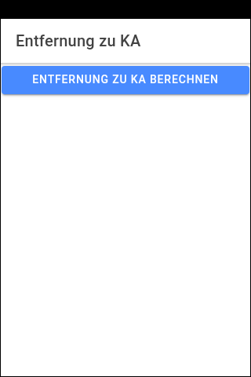
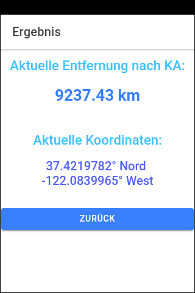

# Ionic-App "Entfernungsberechung" (Distance Calculation) #

Simple [Ionic](https://ionicframework.com) app that tries to obtain current (GPS) location
from device and the calculates the distance to a hard-coded coordinate.

<br>

----
## Plugin for locating ##

Add plugin [geolocation](https://ionicframework.com/docs/native/geolocation) for GPS locating:

````
ionic cordova plugin add cordova-plugin-geolocation

npm install @ionic-native/geolocation
````

Add `Geolocation` to array `providers` in file [src/app/app.module.ts](src/app/app.module.ts).

<br>

----
## Stand-alone program for testing distance calculation ##

Stand-alone programm for test of distance calculation:
[DistanzZwischenZweiKoordinaten.js](DistanzZwischenZweiKoordinaten.js)

````
node DistanzZwischenZweiKoordinaten.js
````

<br>

----
## Screenshots ##

   

<br>

----
## License ##

See the [LICENSE file](LICENSE.md) for license rights and limitations (BSD 3-Clause License)
for the files in this repository.
